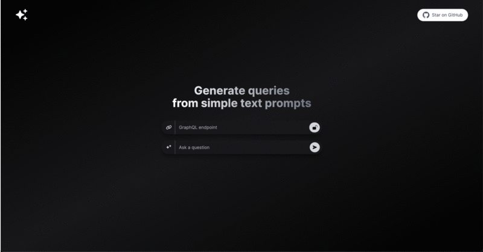

<h1 align="center">GraphQL Explorer</h1>

GraphQL Explorer is a project that simplifies the process of generating queries from plain text prompts. It harnesses the power of AI to make querying your GraphQL APIs a breeze.

## How It Works

This project utilizes the [ChatGPT API](https://openai.com/api/) and the [Vercel AI SDK](https://sdk.vercel.ai/docs) with streaming capabilities. Here's a quick overview of the workflow:

1. **User Input**: You input a text prompt or query in a user-friendly form.

2. **Prompt Construction**: The system constructs a query prompt based on the input.

3. **AI Magic**: The prompt is sent to the ChatGPT API using a Vercel Edge Function.

4. **Streamlined Response**: The AI-generated response is streamed back to the application's user interface, allowing you to view and use the generated query effortlessly.

## Getting Started

1. Clone this repository to your local machine.

2. Create an account on [OpenAI](https://beta.openai.com/account/api-keys).

3. Store your API key in a file named `.env` in the project directory.

4. Run the application from the command line, and it will be available at `http://localhost:3000`.

## Example

#### Endpoint

- SWAPI GraphQL Endpoint: https://swapi-graphql.netlify.app/.netlify/functions/index

#### Question

- Retrieve the titles of all films

## Read More

[Generate GraphQL queries from simple text prompts](https://medium.com/@geobde/generate-graphql-queries-from-simple-text-prompts-d276912d6a60)

## License

See the [LICENSE](./LICENSE) file for licensing information.
